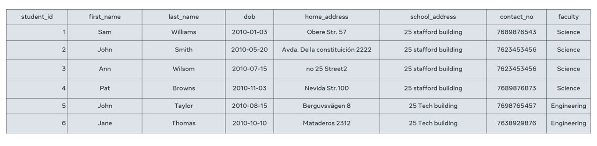
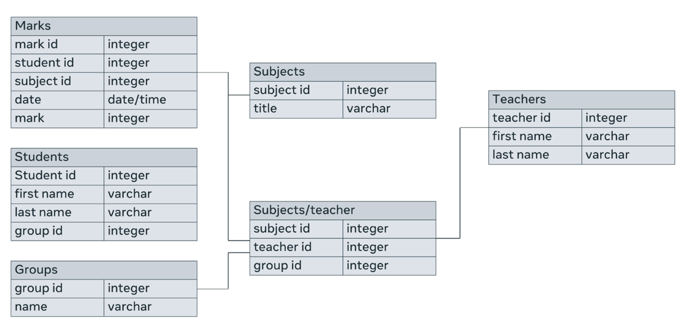
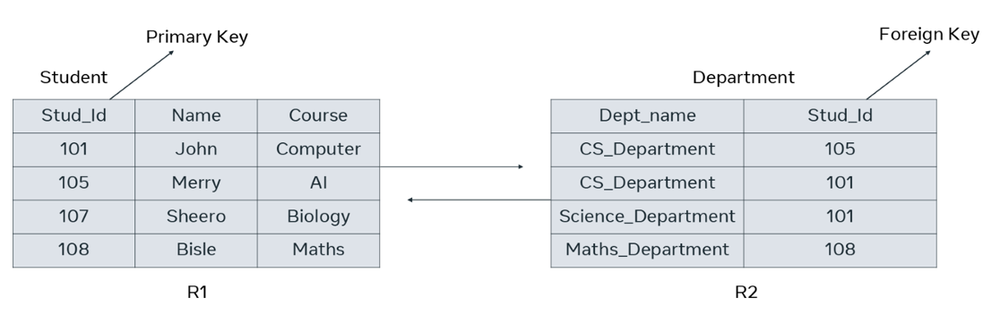

## Data types

- Data types are used to define the type of value that can be stored in a table column.
- Some of the common data types include:
  - Numeric data types such as `INT`, `TINYINT`, `BIGINT`, `FLOAT`, `REAL`.
  - Date and time data types such as `DATE`, `TIME`, `DATETIME`.
  - Character and string data types such as `CHAR`, `VARCHAR`.
  - Binary data types such as `BINARY`, `VARBINARY`.
  - Miscellaneous data types such as:
    - Character Large Object (CLOB) for storing a large block of text in some form of text encoding.
    - Binary Large Object (BLOB) for storing a collection of binary data such as images.
- Each column in a table has a unique name and data type.
- The data type of a column defines the type of value that can be stored in that column.
- The data types can vary depending on the database system.
- It is important to choose the correct data type for each column to ensure that the data is stored correctly and efficiently.

## Example

Here is an example of a table with its columns and data types:

| Column Name   | Data Type    |
| ------------- | ------------ |
| Student ID    | INT          |
| First Name    | VARCHAR(255) |
| Last Name     | VARCHAR(255) |
| Date of Birth | DATE         |
| Home Address  | VARCHAR(255) |
| Faculty       | VARCHAR(255) |

In this example, the `Student ID` column is an integer, the `First Name` and `Last Name` columns are strings, the `Date of Birth` column is a date, the `Home Address` column is a string, and the `Faculty` column is a string.

## Tables in a relational database

- A relational database is a collection of tables.
- Each table represents a set of data about a particular entity.
- For example, a table for students might store data such as student ID, name, address, and phone number.
- A table row or record is a single instance of an entity.
- For example, a row in the student table might represent a specific student.
- Each table column stores a single piece of data about each entity.
- For example, the student ID column might store the student's ID number.
- The schema of a table defines the structure of the table.
- The schema includes the name of the table, the names of the columns, and the data types of the columns.

## Important points

- Tables are the basic building blocks of a relational database.
- Each table stores data about a single entity.
- The schema of a table defines the structure of the table.
- The schema includes the name of the table, the names of the columns, and the data types of the columns.

## Primary key

A primary key is a column or a combination of columns in a table that uniquely identifies each row in the table.

- A primary key cannot have duplicate values.
- A primary key cannot be null.
- A primary key is typically an integer or a sequence number.
- A primary key can be a composite key, which means that it is made up of multiple columns.

## Example

In the student table, the student ID is the primary key. This is because the student ID uniquely identifies each student in the table. The other columns, such as first name, last name, and date of birth, may have duplicate values.

In the employee table, the EMP_ID and DEPT_ID columns together form the primary key. This is because no two employees can have the same EMP_ID and DEPT_ID values.

## Importance of primary key

The primary key is important for several reasons:

- It uniquely identifies each row in the table.
- It can be used to join tables together.
- It can be used to enforce referential integrity.
- It can be used to create unique indexes.

## When not to use a primary key

A primary key should not be used when:

- The column contains duplicate values.
- The column can be null.
- The column is not unique.

## Composite primary key

A composite primary key is a primary key that is made up of multiple columns. This is used when a single column is not enough to uniquely identify each row in the table.

For example, the EMP_ID and DEPT_ID columns together form a composite primary key in the employee table. This is because no two employees can have the same EMP_ID and DEPT_ID values.

## Foreign key

A foreign key is a column in one table that references the primary key of another table.

- A foreign key cannot have duplicate values.
- A foreign key cannot be null.
- The foreign key must reference the primary key of an existing table.

## Example

In the student table, the student ID is the primary key. The department table has a foreign key called department_id that references the student ID in the student table. This means that each department in the department table must have a corresponding student in the student table.

## Importance of foreign key

The foreign key is important for several reasons:

- It enforces referential integrity.
- It can be used to join tables together.
- It can be used to create cascading updates and deletes.

## Referential integrity

Referential integrity is a property of a database that ensures that the data in one table is consistent with the data in another table.

In the example above, referential integrity is enforced by the foreign key constraint on the department_id column in the department table. This constraint ensures that the department_id value in the department table must exist in the student ID column in the student table.

## Joining tables

A foreign key can be used to join tables together. This means that you can combine data from two or more tables into a single result set.

For example, you could join the student table and the department table together to get a list of all students and their departments.

## Cascading updates and deletes

Cascading updates and deletes are features that can be used to automatically update or delete data in one table when data in another table is updated or deleted.

For example, you could configure a cascading delete on the foreign key constraint on the department_id column in the department table. This would mean that if a student is deleted from the student table, the corresponding department record in the department table would also be deleted.

## Database structure

Database structure refers to how data is arranged in a database.

- A database is a collection of tables.
- A table is a collection of rows and columns.
- A row is a record of data.
- A column is a field of data.

## Components of database structure

The components of database structure are:

- **Tables:** Tables are the basic building blocks of a database. They store data about a specific entity.
- **Rows:** Rows are also known as records. They represent a single instance of an entity.
- **Columns:** Columns are also known as fields. They store a single piece of data about each entity.
- **Attributes:** Attributes are the characteristics of an entity. They are the columns in a table.
- **Primary key:** The primary key is a column that uniquely identifies each row in a table.
- **Foreign key:** A foreign key is a column in one table that references the primary key of another table.

## Importance of database structure

The database structure is important for several reasons:

- It determines how the data is stored and organized.
- It affects the performance of queries and updates.
- It makes it easier to understand and manage the data.
- It helps to ensure the accuracy and integrity of the data.

## How to design a database structure

The design of a database structure depends on the specific needs of the application. However, there are some general principles that can be followed:

- The data should be divided into separate tables.
- Each table should store data about a single entity.
- The columns in each table should be related to each other.
- The primary key should be unique for each row in a table.
- Foreign keys should be used to relate tables to each other.

## Benefits of a well-designed database structure

A well-designed database structure can provide several benefits, including:

- Improved performance: A well-designed database structure can improve the performance of queries and updates.
- Increased scalability: A well-designed database structure can make it easier to scale the database as the amount of data grows.
- Improved data integrity: A well-designed database structure can help to ensure the accuracy and integrity of the data.
- Easier to manage: A well-designed database structure can make it easier to manage the data.

## Challenges of designing a database structure

There are several challenges that can be encountered when designing a database structure, including:

- Understanding the requirements of the application.
- Choosing the right data types for the columns.
- Designing the relationships between tables.
- Ensuring the accuracy and integrity of the data.
- Managing the complexity of the database structure.

## Tables

A table is a collection of rows and columns. Each row represents a single instance of an entity, and each column represents a single attribute of that entity.

## Fields

A field is a column in a table. Each field stores a single piece of data about each instance of the entity.

## Records

A record is a row in a table. Each record represents a single instance of the entity.

## Data types

A data type is a classification of data values. Different kinds of data values require different amounts of memory to store them. Different operations can be performed on those data values based on their datatypes.

Some common data types used in databases are:

- Numeric data types such as INT, TINYINT, BIGINT, FLOAT and REAL.
- Date and time data types such as DATE, TIME and DATETIME.
- Character and string data types such as CHAR and VARCHAR.
- Binary data types such as BINARY and VARBINARY.
- Miscellaneous data types such as:
  - Character Large Object (CLOB), for storing a large block of text in some form of text encoding.
  - Binary Large Object (BLOB), for storing a collection of binary data such as images.

## Logical database structure

The logical database structure is a representation of the database schema. It is a diagram that shows the entities, attributes, and relationships between them.

## Relationships

A relationship is an association between two or more entities. There are three types of relationships:

- One-to-one: Each instance of one entity is associated with exactly one instance of the other entity.
- One-to-many: Each instance of one entity can be associated with zero, one, or many instances of the other entity.
- Many-to-many: Each instance of one entity can be associated with zero, one, or many instances of the other entity, and vice versa.

## Entity Relationship Diagram (ERD)

An ERD is a graphical representation of the logical database structure. It shows the entities, attributes, and relationships between them.

Here is an example of an ERD that shows all these elements:

## Physical database structure

The physical database structure is the actual implementation of the database schema on a physical storage device. It is made up of tables, indexes, and other data structures.

## Foreign key

A foreign key is a field in one table that refers to a primary key in another table. Foreign keys are used to establish relationships between tables.

For example, the student table might have a foreign key called department_id that refers to the primary key of the department table. This means that each student must be assigned to a department.

## Relationship between physical database structure and foreign key

In the physical database structure, the relationships between entities are established using foreign keys. The foreign key in one table references the primary key in another table. This ensures that the data in the two tables is consistent.

In the example above, the foreign key department_id in the student table references the primary key department_id in the department table. This ensures that each student is assigned to a unique department.

Here are some important points about foreign keys:

- Foreign keys must always reference the primary key of another table.
- Foreign keys cannot be null.
- Foreign keys must be unique.
- Foreign keys can be used to enforce referential integrity.

