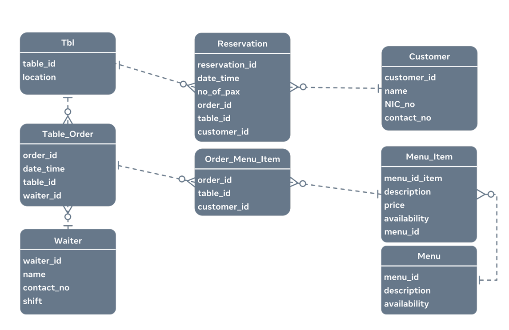

# Building a database schema for a restaurant booking scenario

When building a database schema for a restaurant booking system there are a few things you must consider. You must consider that customers make reservations for tables and those tables have orders associated with them. An order will have associated menu items that belong to a menu. And the orders are served by a waiter.

Building a logical database schema for this scenario would look like this:


- Entities become tables in the physical database design.
- Each entity has a set of attributes, including a primary key that uniquely identifies each entity instance.
- The primary key attributes may also be present in other tables that the table relates to, where they are known as foreign keys.

## The Phyisical Database Schema

Now lets build the physical database schema for this scenario, the first thing would be to create a database:

```sql
CREATE DATABASE restaurant;

USE restaurant;
```

Now lets do the follwing:

- Create the tables inside the database. Use the logical database schema to determine the tables and their fields or columns.
- Use appropriate data types for table columns to ensure efficient memory allocation during physical data storage.

The first table ‘tbl’ represents a table in the restaurant. It has a unique ID and a location – where it’s placed in the restaurant. The unique ID is the `primary key` of this table.

```sql
CREATE TABLE tbl(
    table_id INT,
    location VARCHAR(255),
    PRIMARY KEY (table_id)
    );
```

This next table contains data about waiters who work in the restaurant. They have a unique ID, a name, their contact number and which shift they usually work. The `primary key` of the table is the unique ID assigned to the waiter.

```sql
CREATE TABLE waiter(
    waiter_id INT,
    name VARCHAR(150),
    contact_no VARCHAR(10),
    shift VARCHAR(10),
    PRIMARY KEY (waiter_id)
);
```

Next, we'll need to create a table that stores data about orders for each table. It has the order ID and table ID fields. As well as a date_time field to capture the date and time of the order and the ID of the waiter who’s supposed to serve that table, for that order.

```sql
CREATE TABLE table_order(
    order_id INT,
    date_time TIME,
    table_id INT,
    waiter_id INT,
    PRIMARY KEY (order_id),
    FOREIGN KEY (table_id) REFERENCES tbl(table_id),
    FOREIGN KEY (waiter_id) REFERENCES waiter(waiter_id)
);

```

The next table to create is a customer table which will store information of customers. It has a customer ID, name, NIC number to store the National Identity Card number and the contact number fields. The `primary key` is the unique customer ID field.

```sql
CREATE customer(
    customer_id INT,
    name VARCHAR(100),
    NIC_no VARCHAR(12),
    contact_no VARCHAR(10),
    PRIMARY KEY (customer_id)
);

```

Next, we will create the the reservation table that associates an order with a customer. It has a unique ID, a date and time, number of guests or pax expected, the order_id, table_id and the customer_id. Its `primary key` is the unique reservation_id. This table is linked with the `tbl`, `table_order` and `customer` tables.

```sql
CREATE reservation(
    reservatin_id INT,
    date_time DATETIME,
    no_of_pax INT,
    order_id INT,
    table_id INT,
    customer_id INT,
    PRIMARY KEY (reservation_id),
    FOREIGN KEY (order_id)  REFERENCES table_order(order_id),
    FOREIGN KEY (table_id) REFERENCES tbl(table_id),
    FOREIGN KEY (customer_id) REFERENCES customer(customer_id)
);
```

Next is to create the menu table, it stores all the menus of the restaurant. It has a menu_id which is the unique field that contains descriptions of the menu and its availability.

```sql
CREATE TABLE menu(
    menu_id INT,
    description VARCHAR(255),
    availability INT,
    PRIMARY KEY (menu_id)
);
```

Since every menu can have unique menu items and these menu items are stored against the menu, in the menu_item table. A menu items also has description, price and availability fields. This table links with the menu table.

```sql
CREATE TABLE menu_item(
    menu_item_id INT,
    description VARCHAR(255),
    price FLOAT,
    availability INT,
    menu_id INT,
    PRIMARY KEY (menu_item_id),
    FOREIGN KEY (menu_id) REFERENCES menu(menu_id)
);

```

Last is this this final table to capture the menu items ordered for a specific order. It has the order_id, menu_item_id and the quantity ordered. It has a composite primary key of order_id and menu_item_id field combination and its linked with the table_order and menu_item tables.

```sql
CREATE order_menu_item(
    order_id INT,
    menu_item_id INT,
    quantity INT,
    PRIMARY KEY (order_id, menu_item_id),
    FOREIGN KEY (menu_item_id) REFERENCES menu_item(menu_item_id),
    FOREIGN KEY (order_id) REFERENCES table_order(ordre_id),
);

```

These CREATE TABLE statements create all the tables within the reservation database. The important thing to note is how the relationships are established between the tables. Each table is defined with a primary key, and that in turn becomes the foreign key in the related table.

In conclusion, this is how a basic database structure or schema can be created using SQL DDL (Data Definition Language) syntaxes.
