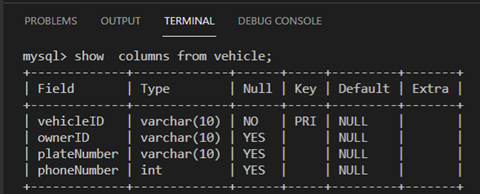

# Keys in depth

```sql
create database authmobile;
use automobile;
create table vehicle(vehicleID varchar(10), ownerID varchar(10), plateNumber varchar(10), phoneNumber INT);
show tables;
show columns from vehicle;
```

Now let’s build another table to maintain data about the vehicles’ owners. This table includes information about the owner's name and address as illustrated below.

```sql
create table owners(ownerID varchar(10), ownerName varchar(50), ownerAddress varchar(55), PRIMARY KEY (ownerID));
show tables;
show columns from owners;
```


This diagram shows the cross-reference between the two tables. The owner ID column represents the foreign key in the vehicle table that refers to the external primary key column in the owner table. This ensures that each vehicle is associated with the right owner. Also, according to the diagram, the relationship is one-to-many, where each owner may own many cars.

To create this relationship in the actual database you need to modify the vehicle table structure to make the owner ID a foreign key. This can be done by using the “ALTER” command to change the structure of the vehicle table. You can also use the "ADD” command to define the owner ID as the foreign key. Finally, you can use a "REFERENCES” keyword to reference it with the primary key in the owner table.

```sql
alter table vehicle add foreign key(ownerID) referneces owners(ownerID);
show columns from vehicle;
```



## Establishing a Primary key with Constraint syntax;

You can create a table for staff members in a college and define email address column as the primary key with the following syntax:

```sql
CREATE staff(email varchar(10) not null, name varchar(25) not null, constraint pk_email primary key (email));
```
