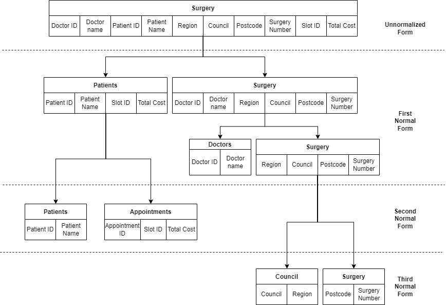

# Database normalization

**What is database normalization?**

Database normalization is a process of organizing data in a database to minimize redundancy and improve data integrity. It is a set of rules that are used to design relational databases.

**Why is database normalization important?**

Database normalization is important because it can help to prevent the following problems:

- **Insert anomaly:** This occurs when you cannot insert a new record into a table because it requires the insertion of data into another table that is not yet available.
- **Update anomaly:** This occurs when you update a record in a table and the update is not reflected in all of the places where the data is duplicated.
- **Delete anomaly:** This occurs when you delete a record from a table and it causes the deletion of other related records that are still needed.

**How to normalize a database**

To normalize a database, you need to split it into smaller tables, each of which contains data about a single entity. For example, you might split a table that contains information about students, courses, and departments into three separate tables:

- A student table with information about each student
- A course table with information about each course
- A department table with information about each department

Once you have split the database into smaller tables, you need to create relationships between the tables. This can be done by using foreign keys. A foreign key is a column in one table that references the primary key in another table.

**Benefits of database normalization**

There are a number of benefits to normalizing a database, including:

- **Improved data integrity:** Normalization helps to ensure that the data in your database is accurate and consistent.
- **Reduced data redundancy:** Normalization helps to reduce the amount of duplicate data in your database.
- **Improved performance:** Normalization can improve the performance of your database by making it easier to query and update data.
- **Increased flexibility:** Normalization makes your database more flexible and adaptable to change.

## The 3 fundamental normalization forms are known as

- First Normal Form (1NF)
- Second Normal Form (2NF)
- Third Normal Form (3NF)

| Doctor ID | Doctor Name | Region      | Patient ID | Patient Name  | Surgery Number | Surgery Council | Postcode | Slot ID  | Total Cost     |
| --------- | ----------- | ----------- | ---------- | ------------- | -------------- | --------------- | -------- | -------- | -------------- |
| D1        | Karl        | West London | P1 P2 P3   | Rami Kim Nora | 3              | Harrow          | HA9SDE   | A1 A2 A3 | 1500 1200 1600 |

The data listed in the table are in an unnormalized form and this is whats wrong this this table;

- Repeating groups of data appear in many cases, for instance, doctors, regions and council names.
- There are multiple instances of data stored in the same cell such as with the patient name and total cost columns. This makes it difficult to update and query data.
- It is not easy to choose a unique key and assign it as a primary key.

This table can be created with the following syntax;

```sql
CREATE TABLE Surgery  (DoctorID VARCHAR(10), DoctorName VARCHAR(50), Region VARCHAR(20), PatientID VARCHAR(10), PatientName VARCHAR(50), SurgeryNumber INT, Council  VARCHAR(20), Postcode VARCHAR(10), SlotID VARCHAR(5), TotalCost Decimal);
```

## First Normal From (1NF):

- The first normal form rule is to enforce the data atomicity and eliminate unnecessary repeating groups of data.
- The data atomicity rule means that you can only have one single instance value of the column attribute in any cell of the table.

In the table about, the atomicity problem only exists in the columns of data related to the patients. Therefore, it is important to create a new table for patient data to fix this. In other words, you can organize all data related to the patient entity in one separate table, where each cell of any column contains only one single instance of data as depicted in the following example.

**Patient Table**
| Patient ID | Patient Name | Slot ID | Total Cost |
| ---------- | ------------ | ------- | ---------- |
| P1 | Rami | A1 | 1500 |
| P2 | Kim | A2 | 1200 |
| P3 | Nora | A3 | 1600 |
| P4 | Kamel | A1 | 2500 |
| P5 | Sami | A2 | 1000 |
| P6 | Norma | A5 | 2000 |
| P7 | Rose | A6 | 1000 |

This table includes one single instance of data in each cell, which makes it much simpler to read and understand. However, the patient table requires two columns: the `patient ID` and the `Slot ID` together to identify each record in a unique way. This means that you need a composite primary key in this table. To create this table in SQL you can write the following code:

```sql
create table patient(patienID varchar(10) not null, patientName varchar(50) not null, slotID varchar(10) not null, totalCost decimal, constraint pk_patient primary key (patientID, SlotID));
```

Once you have removed the patient attributes from the main table, you just have the doctor ID, name, region, surgery number, council and postcode columns left in the table.

| Doctor ID | Doctor Name | Region      | Surgery Number | Surgery Council | Postcode |
| --------- | ----------- | ----------- | -------------- | --------------- | -------- |
| D1        | Karl        | West London | 3              | Harrow          | HA9SDE   |
| D1        | Karl        | East London | 4              | Hackney         | E1 6AW   |
| D2        | Mark        | West London | 4              | Hackney         | E1 6AW   |
| D2        | Mark        | East London | 5              | Harrow          | HA862E   |

You may have noticed that the table also contains repeating groups of data in each column. You can fix this by separating the table into two tables of data: the doctor table and the surgery table, where each table deals with one specific entity.

**Doctor Table**
| Doctor ID | Doctor name |
| ----------| ------------|
| D1 | Karl|
| D2 | Mark|

In the doctor table, you can identify the `doctor ID` as a single column primary key. This table can be created in SQL by writing the following code:

```sql
create table doctor(doctorID varchar(10 not null, doctorName varchar(15) not null, primary key (doctorID));
```

**Surgical Table**
| Surgery Number | Region | Surgery Council | Postcode |
|---|---|---|---|
| 3 | West London | Harrow | HA9SDE |
| 4 | East London | Hackney | E1 6AW |
| 5 | West London | Harrow | HA862E |

The surgery table can have the surgery number as a single column primary key. The surgery table can be created in SQL by writing the following code:

```sql
create table surgical(surgeryNumber int not null, region varchar(50) not null, surgeryCouncil varchar(15) not null, postCode varchar(15) not null, primary key (surgeryNumber));

```

## Second Normal Form (2NF):

- In the second normal form, you need to avoid any partial dependency relationships between data.
- Partial dependency refers to tables with a composite primary key.
- Namely a key that consists of a combination of two or more columns, where a non-key attribute value depends only on one part of the composite key.
- Since the patient table is the only one that includes a composite primary key, you only need to look at the following table.

**Patient Table**
| Patient ID | Patient Name | Slot ID | Total Cost |
| ---------- | ------------ | ------- | ---------- |
| P1 | Rami | A1 | 1500 |
| P2 | Kim | A2 | 1200 |
| P3 | Nora | A3 | 1600 |
| P4 | Kamel | A1 | 2500 |
| P5 | Sami | A2 | 1000 |
| P6 | Norma | A5 | 2000 |
| P7 | Rose | A6 | 1000 |

- In the patient table, you need to check whether there are any non-key attributes depending on one part of the composite key.
- For example, the patient's name is a non-key attribute, and it can be determined by using the `patient ID` only.
- Similarly, you can determine the total cost by using the `Slot ID` only.
- This is called partial dependency, which is not allowed in the second normal form. This is because all non-key attributes should be determined by using both parts of the composite key, not only one of them.

This can be fixed by splitting the patient table into two tables: patient table and appointment table.

In the patient table you can keep the patient ID and the patient's name. The new patient table can be created in SQL using the following code:

```sql
CREATE TABLE Patient  (PatientID VARCHAR(10) NOT NULL, PatientName, VARCHAR(50), PRIMARY KEY (PatientID));
```

| Patient ID | Patient Name |
| ---------- | ------------ |
| P1         | Rami         |
| P2         | Kim          |
| P3         | Nora         |
| P4         | Kamel        |
| P5         | Sami         |
| P7         | Norma        |
| P8         | Rose         |

However, in the appointment table, you need to add a unique key to ensure you have a primary key that can identify each unique record in the table. Therefore, the appointment ID attribute can be added to the table with a unique value in each row of the table.

| AppointmentID | Slot ID | Total Cost |
| ------------- | ------- | ---------- |
| 1             | A1      | 1500       |
| 2             | A2      | 1200       |
| 3             | A3      | 1600       |
| 4             | A1      | 2500       |
| 5             | A2      | 1000       |
| 6             | A5      | 2000       |
| 7             | A6      | 1000       |

The new appointments table can be created in SQL using the following code:

```sql
CREATE TABLE Appointments  (AppointmentID INT NOT NULL, SlotID, VARCHAR(10),  TotalCost Decimal, PRIMARY KEY (AppointmentID));
```

## Third Normal Form (3NF):

For a relation in a database to be in the third normal form, it must already be in the second normal form (2NF). In addition, it must have no transitive dependency. This means that any non-key attribute in the surgery table may not be functionally dependent on another non-key attribute in the same table.

In the surgery table, the `postcode` and the `council` are non-key attributes, and the `postcode` is dependent on the `council`. Therefore, if you change the `council` value, you must also change the `postcode`. This is called transitive dependency, which is not allowed in the third normal form.

**Surgical table**

| Surgery Number | Region      | Surgery Council | Postcode |
| -------------- | ----------- | --------------- | -------- |
| 3              | West London | Harrow          | HA9SDE   |
| 4              | East London | Hackney         | E1 6AW   |
| 5              | West London | Harrow          | HA862E   |

- In other words, changing the value of the council value in the table has a direct impact on the postcode value
- Each postcode in this example belongs to a specific council.
- This transitive dependency is not allowed in the third normal form.

To fix it you can split this table into two tables: one for the region with the city and one for the surgery. The new surgery location table can be created in SQL using the following code:

```sql
CREATE TABLE Location  (SurgeryNumber INT NOT NULL, Postcode VARCHAR(10), PRIMARY KEY (SurgeryNumber));
```

**Location**
| Surgery Number | Postcode |
|---|---|
| 3 | HA9SDE |
| 4 | E1 6AW |
| 5 | HA862E |

The new surgery council table can be created in SQL using the following code:

```sql
CREATE TABLE Council  (Council VARCHAR(20) NOT NULL, Region VARCHAR(20), PRIMARY KEY (Council));
```

**Council Table**
| Surgery Council | Region |
| --------------- | ----------- |
| Harrow | West London |
| Hackney | East London |

This ensures that the database now conforms to first, second and third normal forms.

The following diagram illustrates the stages through which the data moves from the unnormalized form to the first normal form, the second normal form and finally to the third normal form.



However, it’s important to link all tables together to ensure that you have well-organized and related tables in the database. This can be done by defining foreign keys in the tables.

```sql
ALTER table surgery add foreign key (council) references council(council);
ALTER table appointments add foreign key (doctorID) references doctor(doctorID);
ALTER table appointments add foreign key (patientID) references patients(patientID);
ALTER table appointments add foreign key (surgeryNumber) references surgery(surgeryNumber);
```


