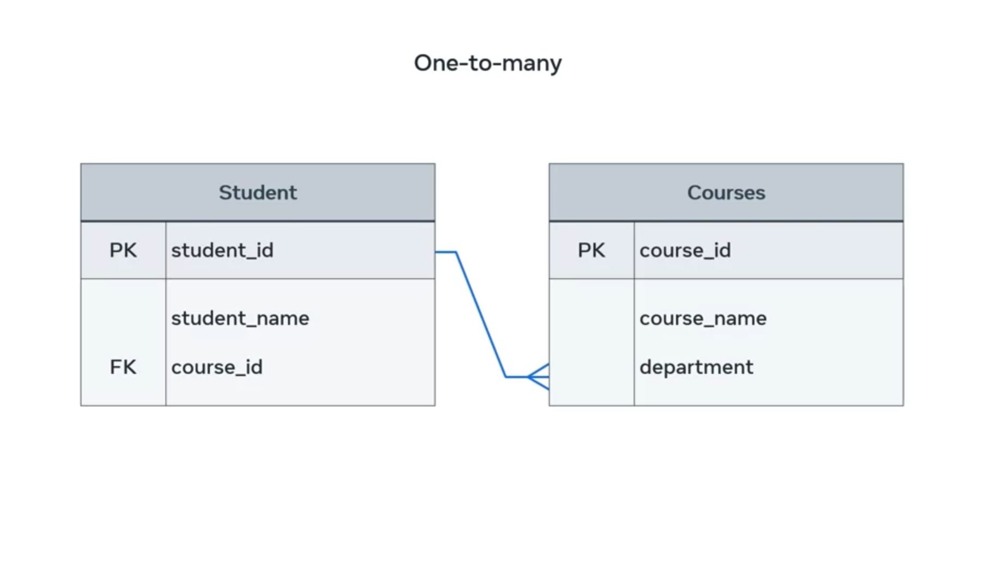

# Relational model

**What is it?**

- A model for organizing data in a database

**How does it influence database design and structure?**

- By defining the relationships between tables

**How does it help to build relationships between tables?**

- By providing a way to link tables together

**Why is it important to structure and connect tables correctly?**

- To ensure that data can be accurately and efficiently retrieved

## Relationships between tables

**One-to-many**

- One record in one table is linked to multiple records in another table
- Example: A student can be enrolled in multiple courses, but a course can only have one student enrolled in it

**One-to-one**

- One record in one table is linked to one record in another table
- Example: A department head can only be in charge of one department, and a department can only have one head

**Many-to-many**

- One record in one table is linked to multiple records in another table, and vice versa
- Example: A student can work on multiple research projects, and a research project can be supervised by multiple students

## ER diagrams

- Used to visually represent the relationships between tables in a relational database
- Symbols used in ER diagrams:
  - Rectangle: Entity
  - Diamond: Relationship
  - Crow's foot: Many-to-many relationship
  - Line: Foreign key

## Example ER diagram

This ER diagram shows that a student can be enrolled in multiple courses, but a course can only have one student enrolled in it. The department_id column in the Course table is a foreign key that references the department_id primary key in the Student table.

## Primary keys in database tables

**What is a primary key?**

A primary key is a unique identifier for each record in a database table. It is used to distinguish one record from another and to prevent duplicate records.

**How to choose a primary key**

When choosing a primary key, it is important to select a column that is unique to each row in the table and that cannot have a null value. This means that the column cannot be empty.

**When to use a composite primary key**

A composite primary key should be used when there is no single column in the table that is unique to each row and cannot have a null value. This can be achieved by combinding 2 rows to create unique values.

# Foreign keys in relational databases

## What is a foreign key?

A foreign key is a column or set of columns in a database table that references the primary key of another table. This creates a relationship between the two tables, allowing you to query and manipulate data across them.

## How to use foreign keys

To use a foreign key, you must first create a relationship between the two tables. This can be done by creating a foreign key constraint in the child table that references the primary key of the parent table.

For example, let's say we have a customer table and an order table. The customer table has a primary key of customer_id, and the order table has a column called customer_id. We can create a foreign key constraint in the order table that references the customer_id primary key to create a relationship between the two tables.

## Benefits of using foreign keys

Foreign keys provide a number of benefits, including:

- Data integrity: Foreign keys help to ensure the accuracy and consistency of your data by preventing invalid relationships between tables.
- Referential integrity: Foreign keys maintain referential integrity by ensuring that all child records have a corresponding parent record.
- Data modeling: Foreign keys allow you to model complex relationships between tables.
- Query performance: Foreign keys can improve query performance by allowing you to join tables efficiently.
