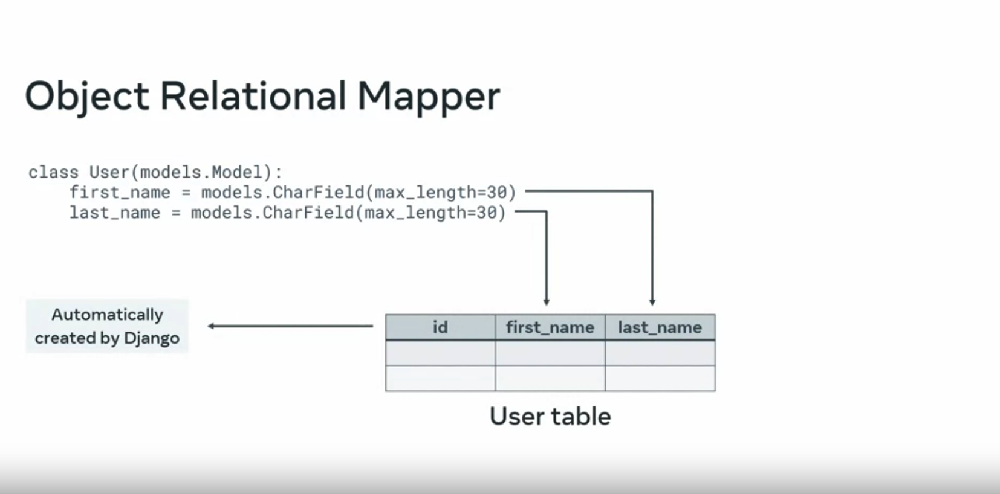

# Creating Models

Django allows you to create models and database using python. This is called `Object Relational Mapper`

```py
class User(models.Model):
    first_name = models.CharField(max_length=30)
    last_name = models.CharField(max_length=30)
```



There will be times where the data model will need to be updated or changed, this is done through a process called `migration` - it records changes made to models and implements these changes to the database schema.

If we were to add a new attribute (column) to a database using SQL, we would code it like so:

```sql
ALTER TABLE user
ADD COLUMN city VARCHAR(255) NOT NULL
```

In Django, with the use of `Object Relational Mapper`, all we need to do is just add a new variable and define the input type like so:

```py
class User(models.Model):
    first_name = models.CharField(max_length=30)
    last_name = models.CharField(max_length=30)
    city = models.CharField(max_length = 30)
```

To impliment the changes, you will run the following migration scrips:

```
manage.py makemigrations
manage.py migrate
```

For every changes you do, you should run makemigrations

```
python manage.py makemigrations

Was person.name renamed to person.person_name (a CharField)? [y/N] y
Migrations for 'myapp':
  myapp\migrations\0002_rename_name_person_person_name.py
    - Rename field name on person to person_name

python manage.py makemigrations
Migrations for 'myapp':
  myapp\migrations\0003_person_age.py
    - Add field age to person

```

You can also see all the unmigrated changes in the model by running showmigrations command:

```
python manage.py showmigrations
. . .
. . .
myapp
[X] 0001_initial
[ ] 0002_rename_name_person_person_name
[ ] 0003_person_age
. . .
```

The X mark which changes have already migrated. The non marked means they are pending. if we run migrate command, both modifications will be refected in the table structure.

To see the actual SQL code that is being executed on a specific migration, you can use `sqlmigrate` command like so:

```
python manage.py sqlmigrate myapp 0001_initial
```

```sql
BEGIN;
--
-- Create model Person
--
CREATE TABLE "myapp_person" (
    "id" integer NOT NULL PRIMARY KEY AUTOINCREMENT,
    "name" varchar(20) NOT NULL,
    "email" varchar(254) NOT NULL,
    "phone" varchar(20) NOT NULL);
COMMIT;
```

To revert back to the previous migrated version, you can use this command:

## to see the results before execution:

```
python manage.py migrate myapp 0001 --plan
```

## to perform:

```
python manage.py migrate myapp 0001
```

## Steps to creating model in the pyhton shell with Django

## Create your model

First, create a class and define your fields and input types like so in the models.py file located in at the app level:

```py
class Menu(models.Model):
    name = models.CharField(max_length = 100)
    cuisine = models.CharField(max_length = 100)
    price = models.IntegerField()

    def __str__(self):
        return self.name + " : " + self.cuisine

```

Here, we created name, cuisine, and price fields with varchar, varchar, and inteter field type. We also added a self method so that when the class objects are called, it returns itself.

## Add your model in settings.py at the project level

```py
INSTALLED_APPS = [
    "django.contrib.admin",
    "django.contrib.auth",
    "django.contrib.contenttypes",
    "django.contrib.sessions",
    "django.contrib.messages",
    "django.contrib.staticfiles",
    "menuapp.apps.MenuappConfig",
]
```

- menuapp - is the name of your app
- apps - is the file app.py in your app folder
- MenuappConfig - is the class thats in this apps.py file

## Make migration

Now, make your migration from the command line:

```
python manage.py makemigrations
```

Then migrate with:

```
python manage.py migrate
```

Now, access your pyhton shell with the following command:

```
python manage.py shell
```

import your model with:

```py
from menuapp.models import Menu
```

Here are some actions you can do within the python sell;

- show all objects:

```py
Menu.objects.all()
```

- create a new record:

```py
m = Menu.objects.create(name = 'pasta', cuisine = 'italian', price = 10)
```

- update a record:

```py
p = Menu.objects.get(pk=2)
p.cuisine = 'chinese'
p.save()
```
