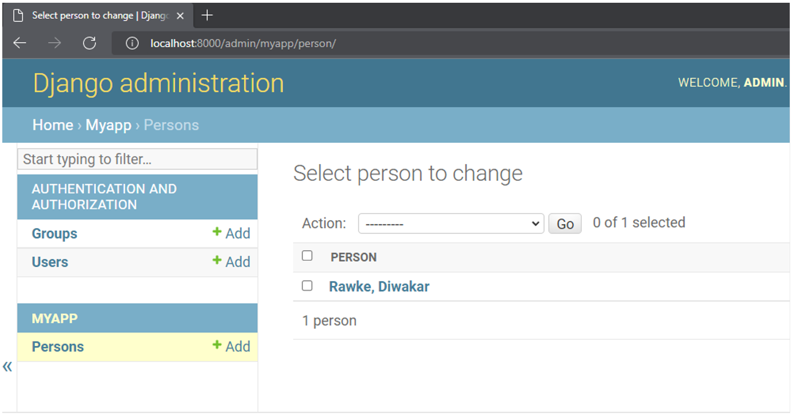

# Admin, Useres, and Permissions

```py
From django.db import models.

class Person(models.Model):
    last_name = models.TextField()
    first_name = models.TextField()

    def __str__(self):
        return f"{self.last_name}, {self.first_name}"

```



```py
From django.contrib import admin.

from .models import Person
@admin.register(Person)
class PersonAdmin(admin.ModelAdmin):
    list_display = ("last_name", "first_name")
```


## Enforucing Permission

### Model Permissions in Admin Interface

Let’s assume that there is a Product model in a Django app named myapp. Here, a custom permission called `change_category` has been defined.

```py
class Product(models.Model):
    ProductID: models.IntegerField()
    name : models.TextField()
    category : models.TextField
    class Meta:
        permissions = [('can_change_category', 'Can change category')]
```

This name of permission will be visible in the list of available user permissions when a new user is added or an existing group is edited. However, outside of the admin environment, the Django models by themselves don't have a mechanism to enforce permissions because it is unaware of the user identity that is performing the action.

```
NOTE: The Django app receives user information through the request context. Often, permissions are enforced at the view layer. However, you can do so from inside templates, URLs and function-based and class-based views.
```

## **Enforucing at the View Layer**

If a user has logged in and has been authenticated, its details are available to the view function in the form of request.user object. If not, the value of request.user is an instance of AnonymousUser. In that case, the permission to call a view can be denied as follows:

```py
from django.core.exceptions import PermissionDenied
def myview(request):
    if request.user.is_anonymous():
        raise PermissionDenied()
```

Alternatively, you can decorate the view with a `@login_required` decorator. It only allows access for logged users.

```py
from django.http import HttpResponse
from django.contrib.auth.decorators import login_required
 @login_required
def myview(request):
    return HttpResponse("Hello World")
```

Another way of restricting access to a view is by using the `@user_passes_test()` decorator. It takes one mandatory argument, which is a function returning True or False. If True is returned, the decorated view function defined below it is invoked.

Let’s define a function `testpermission()`. It returns True if the user is authenticated and has a change_category permission.

```py
def testpermission(user):
    if user.is_authenticated() and user.has_perm("myapp.change_category"):
        return True
    else:
        return False
```

This function is then used as an argument to the `@user_passes_test()` decorator. The view function defined below it will be invoked if the `testpermission()` function returns True.

```py
from django.contrib.auth.decorators import user_passes_test

@user_passes_test(testpermission)
def change_ctg(request):
    # Logic for making change to category of product model instance
```

The `user_passes_test()` can be given an additional argument – `login_url`. The user will be redirected to this URL if the `testpermission()` function returns False. Typically, it is mapped to a view that renders a login page.

Another method to enforce permission at the view level is with the `@permission_required()` decorator. Unless the user possesses the permission mentioned as an argument, the view function won’t be called.

```py
from django.contrib.auth.decorators import permission_required

@permission_required("myapp.change_category")
def store_creator(request):
    # Logic for making change to category of product model instance
```

The above example enforces the permission on a function-based view. Django framework also has a class-based view mechanism.

To enforce permissions on a class-based view, you need to use `PermissionRequiredMixin` and set the `permission_required `attribute of the view class to the permission you want to enforce.

Assuming that a product model is present in models.py. The ProductListView class view renders a list of products only if the user has view permission on this model.

Here is an example:

```py
from django.contrib.auth.mixins import PermissionRequiredMixin
from django.views.generic import ListView

from .models import Product

class ProductListView(PermissionRequiredMixin, ListView):
    permission_required = "myapp.view_product"
    template_name = "product.html"
    model = Product
```

```
Relatable to having a chamaster NFT database or model.  ChamsteNftView class view renders a list of Chamster NFTs only if the user has view permission on this model or if the user is connected to WalletConnect.
```

## **Enforcing permissions in Template**

To generate dynamic content on the web page, Django uses its own template language. Along with conditional and iterative statements (if and for), the special variables user and perms are available inside the template language blocks.

These variables are passed into the template context by the view function. Then, you can check various user attributes, such as `is_authenticated` and render the information on the web page accordingly. A typical template looks like this:

```html
<html>
<body>

         {#  to be rendeed if the user has been authenticated  #}
    
<body>
</html>
```

Similarly, the available permissions can be checked inside the template with `perms.name` syntax.  
For example:

```html
<html>
<body>

  {#  To be rendered for users having required permission #}
   
<body>
</html>
```

## **Enforcing permissions in URL patterns**

This method is especially useful when there’s a view function to intercept the request and the URL directly sends the control to a static page.

To configure the pattern, you use the `url()` function, in which the `permission` decorators can be used.

```py
from django.conf.urls import url
from django.contrib.auth.decorators import login_required, permission_required

urlpatterns = [
    url(r'^users_only/', login_required(myview)),

    url(r'^category/', permission_required('myapp.change_category', login_url='login')(myview)),
]
```

So overall permission can be done through the admin site, at the view level, inside the template as well as while defining URL patterns.
