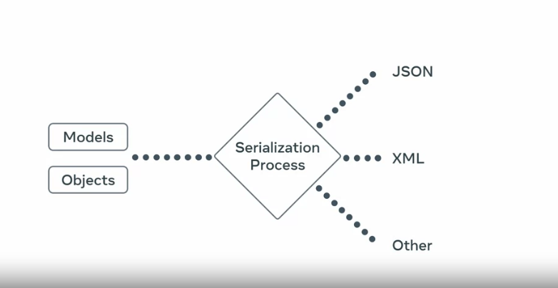

# Serializers

You can pull data from your databases using Django Model and then represent the data to clients


You can also convert user supplied database to your models to store them safely in a database. Before storing this data, you can use Serializers to caoid data corruption


Serialization process converts Models and Objects into a more readible format like `JSON`, `XML`, or `other`


Serializers can also parse the jason model and map them into an existing model.


The opposite of Serialization is Deserialization.

Serializers can also validate data during this Deserialization process, ensuring that the data is cleaned and consistent.


## How to use them effectively in my projects

- Create a new file called `serializers.py` in your Django App directory
- Review the fields of a Modle that exist within your project in the `models.py` file
- Before creating a serializers, you should have a method to fetch all items in your `views.py`

```py
from rest_framework.response import Response
from rest_framework.decorators import api_view
from .models import MenuItem

# Function Based View Example
@api_view()
def menu_items(request):
    items = MenuItem.objects.all()
    return Response(items.values())

# Class based View Example
```

- If there are specific fields you don't want to expose to the public, you cannot hide it without a using a serializers
- Open the `serializers.py` file and write the following code:

```py
from rest_framework import serializers

class MenuItemSerializers(serializers.Serializer):
    id = serializers.IntegerField()
    title = serializers.CharField(max_length=255)
```

- the serializers field are the same as the ones in the Model. You can add all the ones that you want to be displayed in public here.

- lets visit the `views.py` file and add the serializer

```py
from rest_framework.response import Response
from rest_framework.decorators import api_view
from .models import MenuItem
from .serializers import MenuItemSeriazlier

@api_view()
def menu_items(request):
    items = MenuItem.objects.all()
    serialized_item = MenuItemSerializer(item, many = true)
    return Response(serialized_item.data)
```

The Arguments of many = true, this is essential when you're converting a list to JSON data.

When you visit the API endpoints, the fields that should be presented should be id and Title. If there are other fields you would like to add, you can do so by adding them to the serializers.

You can also create this for a single record by create a new method in the `views.py` file

```py
from rest_framework.response import Response
from rest_framework.decorators import api_view
from .models import MenuItem
from .serializers import MenuItemSeriazlier

@api_view()
def menu_items(request):
    items = MenuItem.objects.all()
    serialized_item = MenuItemSerializer(item, many = true)
    return Response(serialized_item.data)

@api_view()
def single_items(request, id):
    items = MenuItem.objects.all()
    serialized_item = MenuItemSerializer(item)
    return Response(serialized_item.data)
```

many = true is not required to convery a single object.

## What happens when you visit an endpoint with a non existing ID?

- you will get server erorrs

But you can convert it into a friendly message using:

```py
from django.shortcuts import get_object_or_404
```
