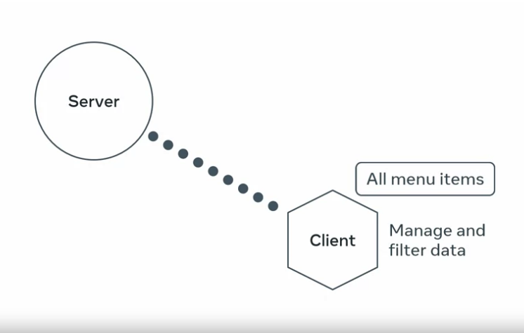
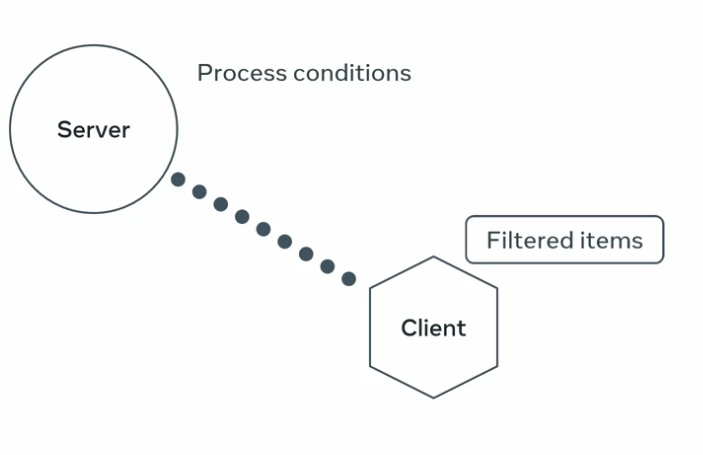

# Filtering and Searching

There are 2 ways to present menu items

1. The Server sends all the information and the Client Application manage and filter all the data



2. Process the conditions on the server and deliver the results that matches the criteria.



Pros and cons

- first approach takes less time but can load on the server if there is a lot of data
- second time will take more time to develop but is more efficient since its done ont he server side.

Client application can pass a query string to the mnue items endpoint with the query string, `?category=` and then the item they are searching for. They can also filter the menu by price by adding `?` `to_price=`

Like so:
`http://127.0.0.1:8000/api/menu-items/?category=main`
`http://127.0.0.1:8000/api/menu-items/?to_price=3`

or you can use both criteria with the `&` sign in between
`http://127.0.0.1:8000/api/menu-items/?to_price=3&category=main`

So to get going, lets visit the views.py file

```py
from django.shortcuts import get_object_or_404
from rest_framework.response import Response
from rest_framework.decorators import api_views, renderer_classes
from .models import MenuItem
from .serializers import MenuItemSerializer
from rest_framework import status

@api_view(['GET', 'POST'])
def menu_items(request):
    if (request.method=='GET'):
        items = MenuItem.object.select_related('category').all() # add paramerters after where you have fetched for the items
        category_name = request.query_paramsget('category') # Param 1
        to_price = request.query_param.get('to_price') # Param 2
        if category_name: # check if user supplied a categery_name parameter
            items = items.filter(category__title=category_name) # very imported ! when connecting a filed to a model, use double underscore "__"  in this case, category is the model and title is the field
        if to_price: # check if user supplied a categery_name parameter
            items = items.filter(price__lte=to_price) # using double underscore to connect the model to the field, lte stands for less than or equal.  There are more built in operator field look up in the django docs.
        serialized_item = MenuItemSerializer(items, many = True)
        return Response(serialized_item.data)
    elif request.method == 'POST':
        serialized_item = MenuItemSerializer(data=request.data)
        serialized_item.is_valid(raise_exception=True)
        serialized_item.save()
        return Response(serialized_item.validated_data, status.HTTP_201_CREATED)
```

Now lets lets set up for Seraches

You can do this by adding `?search=`
`http://127.0.0.1:8000/api/menu-items/?search=chocolate`

We will continue from where we left off in our previous code and build on from that

```py
from django.shortcuts import get_object_or_404
from rest_framework.response import Response
from rest_framework.decorators import api_views, renderer_classes
from .models import MenuItem
from .serializers import MenuItemSerializer
from rest_framework import status

@api_view(['GET', 'POST'])
def menu_items(request):
    if (request.method=='GET'):
        items = MenuItem.object.select_related('category').all()
        category_name = request.query_paramsget('category')
        to_price = request.query_param.get('to_price')
        search = request.query_param.get('serach')
        if category_name:
            items = items.filter(category__title=category_name)underscore "__"  in this case, category is the model and title is the field
        if to_price:
            items = items.filter(price__lte=to_price)less than or equal.  There are more built in operator field look up in the django docs.
        if search:
            items = items.filter(title__startswith=search)
            # items = items.filter(title__containswith=search) # incase if you want to search that the words are present anyywhere in the title
            # items = items.filter(title__icontainswith=search)  # making the search case insentive
            # items = items.filter(title__startswith=search) # there is also a case insensitive for startwith

        serialized_item = MenuItemSerializer(items, many = True)
        return Response(serialized_item.data)
    elif request.method == 'POST':
        serialized_item = MenuItemSerializer(data=request.data)
        serialized_item.is_valid(raise_exception=True)
        serialized_item.save()
        return Response(serialized_item.validated_data, status.HTTP_201_CREATED)
```
