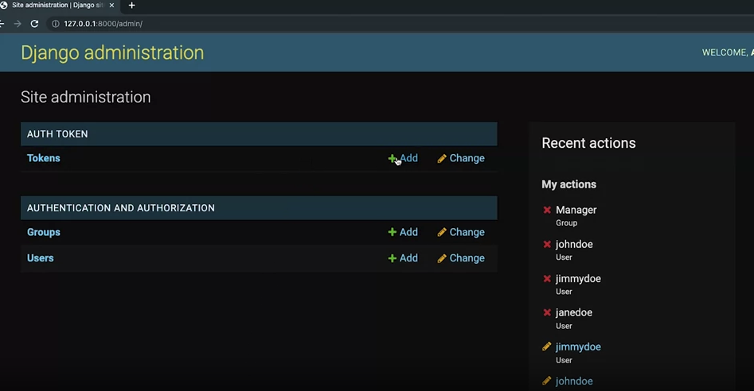
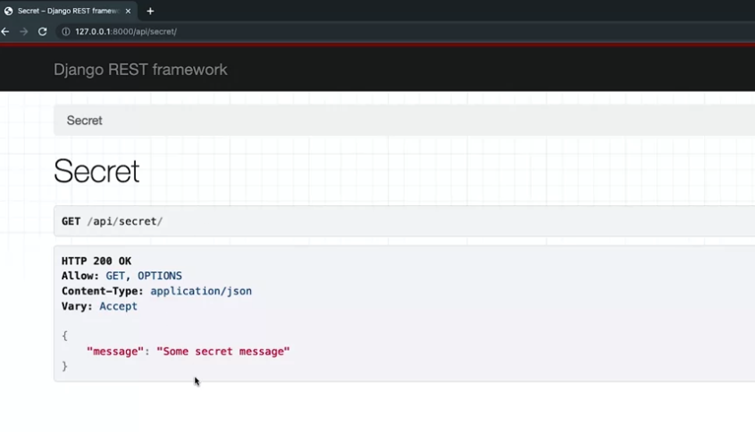
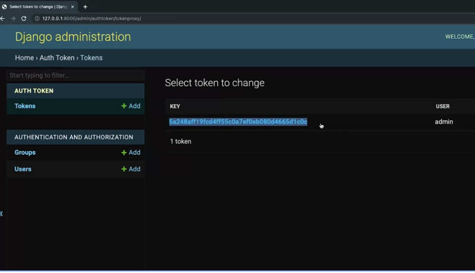
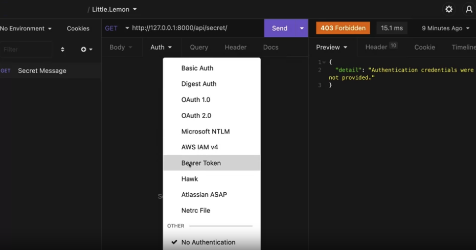
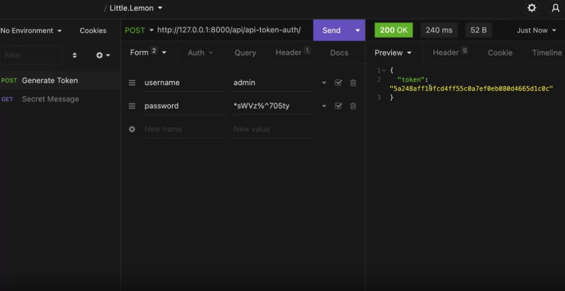
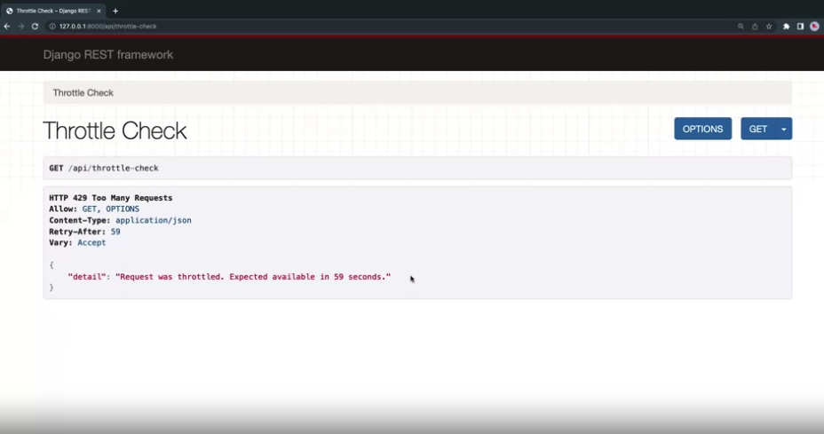
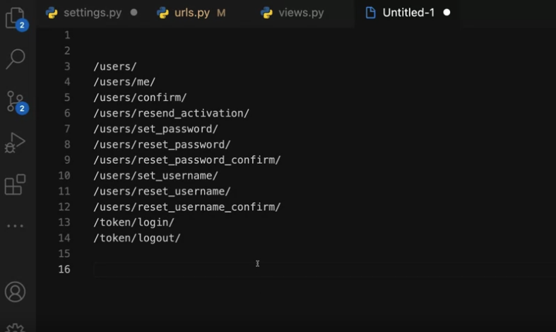
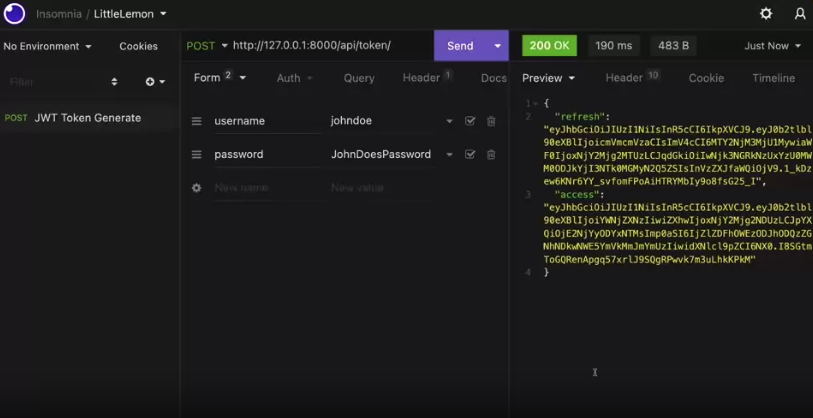

# Securing an API in Django REST - USER MANAGEMENT

---

## Token-based authentication

### Enabling Token Authentication

We can enable the Token-based authentication in the settings.py file under the `INSTALLED_APPS`

`settings.py`

```py
INSTALLED_APP = [
    'rest_framework.authtoken',
]
```

Now when you access the admin page of the application (you should have created a superuser from the beginning), you can see the `AUTH TOKEN`, you can manage tokens here.



### Protecting an API End-point

Open the views.py file and add the following code:

`views.py`

```py
@api_view()
def secrete(request):
    return Response("message":"Some secrete message")
```

now map it in the urls.py file with the following:

`urls.py`

```py
urlpatterns = [
    path('secrete/',views.secrete)
]
```

Now any client client can access this end point, which isnt secrete at all... so lets make it secrete.


So, lets protect it so only users with Tokens can accessed it. We can do this my importing the `IsAuthenticated` and `permission_classes` from the `rest_framework.permissions` and `rest_framework.decorators` into our views.py file. Then we'll going to add the permission_class decorator before our secrete function.

`views.py`

```py
from rest_framework.permissions import IsAuthenticated
from rest_framework.decorators import permission_classes

# rest of the code

@api_view()
@permission_classes([IsAuthenticated]) # adding in the decorator and the classes we imported in.
def secrete(request):
    return Response("message":"Some secrete message")
```

This shouldn't decline access to the secrete end-point because we havn't adjusted out settings.py file. Go to our settings.py file and add the following under REST_FRAMEWORK:

`settings.py`

```py
REST_FRAMEWORK = [
    'DEFAULT_AUTHENTICATION_CLASSES': (
        'rest_framework.authentication.TokenAuthentication',
    ),
]

```

You can test this by using Insomnia application. First access the admin page to copy the TOKEN ID from the token list


Now, in Insomnia, you can access the Auth dropdown menu and select Bearer Token and copied in the token id in the TOKEN filed and write in TOken in the prefix field.



This creates the following header when sedning a GET request header:

```py
"Authentication": Token 5345873428fjksdfg23r9adfkjn8232243kjdsfodsfgoiuuhdskjaio34343322
```

Now the secrete message is accessable.

### Creating tokens from an API End-point

Access the `urls.py` file and import the `obtain_auth_token` from the `rest_framework.authtoke.views`

`urls.py`

```py
from rest_framework.authtoken.views import obtain_auth_token

urlpatterns = [
    ## rest of the path
    path('api-token-auth/', obtain_auth_token) # this endpoint will only accet POST calls
]
```

Then send a post call to this end point: `http://127.0.0.1:8000/api/api-token-auth/`

DRF will then tell you that you need to supply a username and password. You can then add a new user and password that you recetly created, and send the POST again (This is all done in Insomnia by the way) if the Credentials are valid, DRF returns the uesr's token ID in response.



---

## User Roles

We can set roles for specific users to privileges and allow users to specific actions (GET, POST, PUT, PATCH, DELTE)

Lets start by creating the different groups in the admin panel. Lets create a group called `Manager` and create 2 users, one will be the manager and the other will be the customer. One of the user must be assigned with a Mangaer group, while the other doesnt.

Now access the `views.py` file and create a new method called manager_view, don't forget to add the @permission_classes decorator. Then map this to the urls.py file

`views.py`

```py
@api_view()
@permission_classes([IsAuthenticated]) # adding in the decorator and the classes we imported in.
def manager_view(request):
    return Response("message":"Only Manager should see this")
```

`urls.py`

```py

urlpatterns = [
    path('manage-view/', views.manager_view)
]

```

Now, lets request a token for both the manager and customer using the `/api/api-token-auth/` endpoint, then save your token ID as we will use it later.

To test this, lets access the `manager-view/` endpoint with the manager's token. it should dis play the message "Only Manager should see this".

If this was tested with the customer, it will still show the same message "Only Manager should see this". Lets fix this!

Go back tot he views.py file and add a condition to check if a user belongs to the Manager group.

`views.py`

```py
@api_view()
@permission_classes([IsAuthenticated]) # adding in the decorator and the classes we imported in.
def manager_view(request):
    if request.user.groups.filter(name='Manager').exists(): # this line checks if the user belongs in the group called manager
        return Response({"message": "Only Manager Should see this!"})
    else:
        return Response({"message":"You are not authorized"},403)
```

---

## Setting Up API Throttling

Throttling is a very efficient technique to prevent API abuse. Computing power and bandwidth are involved with every request. If you don't monitor it, your API infrastructure will be at risk.

There are major types, one is for Anonymous and the other is for Authenticated users. Specific Throttling rates are based on these two types users which are distinguished by tokens in the headers.

Lets create a case that we want Authenticated users to call on an end-point 10 times per minute.

We can start by creating a method in our views.py file called trottle_check and map it to the urls.py page:

`views.py`

```py

@api_view()
def throttle_check(request):
    return Response({"message":"successful"})

```

`urls.py`

```py
urlpatterns = [
    # other paths
    path('throttle-check', views.throttle_check),
]
```

Lets start by setting a rate of 2 times per minute for anonymous uesrs. We can do this by importing the `AnonRateThrottle` from the rest_framework.throttling module and the `throttle_classes` from the `rest_framework.deceorators` module in our views.py file. Then add the `@throttle_classes` decorator before our throttole_check method. After, we will need to add `DEFAULT_THROTTOLE_RATE`: to the `REST_FRAMEWORK` in our `settings.py` file.

`views.py`

```py
# other imports
from rest_framework.decorators import permission_classes
from rest_framework.throttling import AnonRateThrottle

# other code

@api_view()
@throttle_classes([AnonRateThrottle]) #instructs DRF to use the anonymous throttling policy for this function
def throttle_check(request):
    return Response({"message":"successful"})

```

`settings.py`

```py
REST_FRAMEWORK = {
    'DEFAULT_THROTTLE_RATES': {
        'anon':'2/minute', # instead of using minute, we can also use second, hour, or day.
    }
}

```

You can check our code by access the endpoint and refreshing the pages more than 2 times, after the second time DRF blocks the call with an unavailable message.



Now to set a specific rate for an authenticated user, we can import the `UserRateThrottle` from `rest_framework.throttling` module and create a function for only authenticated users. Then don't forget to map the function to the urls.py as well as include a user and rate in the setting.py file.

`views.py`

```py

from rest_framework.throttling import UserRateThrottle

@api_view()
@permission_classes([IsAuthenticated])
@throttle_classes([UserRateThrottle]) #instructs DRF to use the user throttling policy for this function
def throttle_check_auth(request): #adjust the name
    return Response({"message":"successful"})

```

`urls.py`

```py
urlpatterns = [
    # other paths
    path('throttle-check-auth', views.throttle_check_auth),
]
```

`settings.py`

```py
REST_FRAMEWORK = {
    'DEFAULT_THROTTLE_RATES': {
        'anon':'2/minute', # instead of using minute, we can also use second, hour, or day.
        'user':'5/minute',
    }
}

```

Say we wanted a policy for another endpoint so that authenticated users can call them 10 times per minute.

Lets create a new file called throttles.py in our app director.

`throttle.py`

```py
from rest_framework.throttling import UserRateThrottle

class TenCallsPerMinute(UserRateThrottle):
    scope='ten'
```

now adjust the settings.py file like so;

`settings.py`

```py
REST_FRAMEWORK = {
    'DEFAULT_THROTTLE_RATES': {
        'anon':'2/minute', # instead of using minute, we can also use second, hour, or day.
        'user':'5/minute',
        'ten':'10/minute'
    }
}

```

Then we import this to our views.py file and use the class for any of the authentication calls, if a new one, dont forget to map it by updating the urls.py file.

views.py

```py

from .throttles import TenCallsPerMinute

@api_view()
@permission_classes([IsAuthenticated])
@throttle_classes([TenCallsPerMinute])
def another_function(request):
    return Response({"message":"successful"})

```

---

## API Throttling for class-based views

### Introduction

You already learned about the basics of rate limiting or throttling earlier in the course. But, in this reading, you will learn how to quickly implement throttling in class-based views. You will also learn about how some real-world services use this API throttling to protect their API endpoints from abuse.

### Project scaffolding

Use a class-based view to extend the ModelViewSet to quickly implement a functional CRUD API endpoint for the menu items. To create this class-based view add these lines in the views.py file.

`views.py`

```py
from rest_framework.response import Response
from rest_framework import viewsets
from .models import MenuItem
from .serializers import MenuItemSerializer

class MenuItemsViewSet(viewsets.ModelViewSet):
    queryset = MenuItem.objects.all()
    serializer_class = MenuItemSerializer

```

Open the urls.py file and map this MenuItemViewSet class to the menu-items API endpoint. Map only the GET methods.

`urls.py`

```py
from django.urls import path
from . import views
urlpatterns = [
    path('menu-items',views.MenuItemsViewSet.as_view({'get':'list'})),
    path('menu-items/<int:pk>',views.MenuItemsViewSet.as_view({'get':'retrieve'})),
]
```

Now you can list all menu items by visiting http://127.0.0.1:8000/api/menu-items and any single menu item by visiting http://127.0.0.1:8000/api/menu-items/1.

### Add support for throttling

DRF comes with excellent throttling classes that you can use straight out of the box. To do this, add the following lines in the settings.py in the `REST_FRAMEWORK` section.

`settings.py`

```py
'DEFAULT_THROTTLE_CLASSES': [
        'rest_framework.throttling.AnonRateThrottle',
        'rest_framework.throttling.UserRateThrottle'
],
```

Now you can implement throttling in your API project.

### Throttling for class-based views

Class-based views don’t use the throttle_classes decorator like function-based views. To use throttling, you need to pass the throttle classes to a public class property called `throttle_classes`. First import the necessary classes in the views.py file. Then create a public property called `throttle_classes` with either one or both of these two classes, `UserRateThrottle` or `AnonRateThrottle`.

`views.py`

```py
from rest_framework.throttling import UserRateThrottle, AnonRateThrottle

# Other cldoes

class MenuItemsViewSet(viewsets.ModelViewSet):
    throttle_classes = [AnonRateThrottle, UserRateThrottle]
    queryset = MenuItem.objects.all()
    serializer_class = MenuItemSerializer

```

Now the menu-items API endpoints will be throttled for both anonymous and authenticated users. You can define the throttling rate for both in the settings.py file. If you want to limit the API calls to 5 per minute for anonymous users and 10 per minute for authenticated users, then add the following lines in the REST_FRAMEWORK section, as you learned in a previous video.

`settings.py`

```py
'DEFAULT_THROTTLE_RATES': {
        'anon': '2/minute',
        'user': '10/minute'
}
```

To test if the throttling is working properly, go to the http://127.0.0.1:8000/api/menu-items endpoint three times. After the second visit, the client will see an error message.

### Conditional throttling

It’s very easy to implement conditional throttling in class-based views. With conditional throttling, you can throttle API endpoints only for the specific HTTP methods, like GET calls, or POST calls.

For example, you can have conditional throttling that throttles POST calls, but not GET calls. You can do this by overriding the get_throttles method. In a class-based view that extends a ModelViewSet class, the POST call is handled by create methods. Similarly, the GET call is handled by the list method. Add the following lines of code to implement conditional throttling in the MenuItemsViewSet class.

Note: The throttle_classes is not used as a public attribute this time

`views.py`

```py
class MenuItemsViewSet(viewsets.ModelViewSet):
    # throttle_classes = [AnonRateThrottle, UserRateThrottle]
    queryset = MenuItem.objects.all()
    serializer_class = MenuItemSerializer
 
    def get_throttles(self):
        if self.action == 'create':
            throttle_classes = [UserRateThrottle]
        else:
            throttle_classes = [] 
        return [throttle() for throttle in throttle_classes]
```

Instead, this checks if the router called the create action, which handles the POST request. If that action is called, implement the throttling class UserRateThrottle. The POST calls will be limited to 10 calls per minute to this menu-items endpoint.

### Custom throttling classes

You can use the custom throttling classes you created earlier in the course, like TenCallsPerMinute in the throttles.py file. All you have to do is import this class and then add it in the throttle_classes attribute, and you are done.

`views.py`

```py
from .throttles import TenCallsPerMinute

class MenuItemsViewSet(viewsets.ModelViewSet):
    # throttle_classes = [AnonRateThrottle, UserRateThrottle]
    queryset = MenuItem.objects.all()
    serializer_class = MenuItemSerializer

 
    def get_throttles(self):
        if self.action == 'create':
#             throttle_classes = [UserRateThrottle]
            throttle_classes = [TenCallsPerMinute]
        else:
            throttle_classes = [] 
        return [throttle() for throttle in throttle_classes]

```

### Real world examples of API rate limits

Here are some popular services and their current rate limit. This can help you to get some idea of how others are using such features in their API projects.

| Service                 | Anonymous | Authenticated |
| ----------------------- | --------- | ------------- |
| Facebook graph API      | X         | 200/hour      |
| Instagram API           | X         | 200/hour      |
| Instagram Messenber API | X         | 100/second    |
| WhatsApp messaging API  | X         | 80/second     |

## Authentication Library for Quick Startup (templates) Djoser

Lets install djoser in our virtual environment:

```bash
pipenv shell

pipenv install djoser

```

Then we need to add the djoser app in our INSTALLED_APPS of the settings.py file section

! Its very important that djoser comes after the rest_framework app !

Then create a new section in the settings.py file called Djoser and specify a user for a USER_ID_FIELD key.

REmember, we added the TokenAuthentication before -- if we want to use the Django admin log in simultaneously with the browsable API view of DJOSER, we need to add the SessionAuthentication class as well.

Then we need to enable these ends points in the urls.py file.

`settings.py`

```py
'INSTALLED_APPS' = [
    # Other apps
    'rest_framework',
    'djoser',
]

'REST_FRAMEWORK' = [
    # OTher codes

    'DEFAULT_AUTHENTICATION_CLASSES': (
        'rest_framework.authentication.TokenAuthentication',
        'rest_framework.authentication.SessionAuthentication', # Adding in this line so we can use both the DRF authentication and Djoser framework.
    ),
],

DJOSER = {
    "USER_ID_FIELD": "username",
    # "LOGIN_FIELD" : "email", # incase if you want to use email as the username
}

```

`urls.py`

```py

from django.urls import path
from . import views
urlpatterns = [
    path('auth/', include('djoser.urls')),
    path('auth/', include('djoser.urls.authtoken')),

]

```

here are a list of handy endspoints from djoser that can be accessed with http://127.0.0.1:800/auth:


## Registration and Authentication endpoint with JWT

We can install the package with the following code:

```bash
pipenv install djangorestframework-simplejwt~=5.2.1
```

Then go to settings.py file and add it in the `INSTALLED_APPS` and `DEFAULT_AUTHENTICATION_CLASSES`

`settings.py`

```py
'INSTALLED_APPS' = [
    'rest_framework_simplejwt',
]

REST_FRAMEWORK = {
    'DEFAULT_AUTHENTICATION_CLASSES': (
        'rest_framework_simplejwt.authentication.JWTAuthentication',
        # other add ins
    )
}

```

Then we import classes from the `rest_framework_simplejwt.views` module. The package also needs the following end-points path.

`urls.py`

```py
from rest_framework_simplejwt.views import TokenObtainPairView, TokenRefreshView


urlpatterns = [
    path('api/token/', TokenObtainPairView.as_view(), name='token_obtain_pair'),
    path('api/token/refresh/', TokenRefreshView.as_view(), name='token_refresh'),
]

```

Now we can test this with Insomnia, by seding a username and password POST to the http://127.0.0.1.8000:/api/token/

2 tokens are return in response, and keep a note of these as we will use them in next process.


- 1 token is access token which client uses to authenticate the API calls (expires after 5 mins)
- 1 token is the refresh token, to reactivate to regenerate the access token.

These settings can be adjusted in the settings.py file, but it is always a good idea to keep the time short.

Used the Access token in the AUth ->bearer token to send a request. Things should be working perfectly.
Once the token is expired, you can access http://127.0.0.1.8000:/api/token/refresh/ with the form -> URL Encoded and type in refresh key and the refresh token as value. A new access token should be generated.

### how to black list a reresh token:

add this code in the INSTALLED APP in the settings.py file

settings.py

```py
INSTALLED_APPLS = [
    'rest_framework_simplejwt.token_blacklist',
]

```

Run the migration and rerun the web server.

Then go to `urls.py` file and add import the TokenBlacklistView.

`urls.py`

```py

from rest_framework_simplejwt.views import TokenObtainPairView, TokenRefreshView
from rest_framework_simplejwt.views import TokenBlacklistView


urlpatterns = [
    path('api/token/', TokenObtainPairView.as_view(), name='token_obtain_pair'),
    path('api/token/refresh/', TokenRefreshView.as_view(), name='token_refresh'),
    path('path/token/blacklist/', TokenBlacklistView.as_view(), name = 'token_blacklist')
]

```

You can repeat the same process as above using FOrm -> URL encoded with the refresh as key and refresh token POST to path/token/blacklist/ path.

## User Account Management

Using Djoser will simplify things, so lets get started. Lets say we want to create a manager. We will need to import `IsAdminUser`, User and Group class

```py
from rest_framework.permissions import IsAdminUser
from django.contrib.auth.models import User, Group

@api_view(['POST'])
@permission_classes([IsAdminUser]) #add that to permissions_classes decorator
def managers(request):
    username = request.data['username'] # requesting user's name
    if username: # check if the user exist
        user = ger_object_or_404(User, username = username)
        managers = Group.objects.get(name = "Manager")
        if request.method == 'POST': # check if its a post
            managers.user_set.add(user)
        elif request.method == 'DELETE': # check if its a delete
            managers.user_get.add(user)
        return Response({"message": "ok"})

```

`urls.py`

```py

urlpatterns =[
    path('group/manager/users', views.managers)
]

```

You can test this in insomnia
