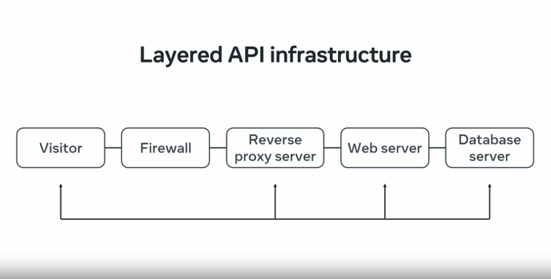

# Cahcing

Caching can be done at the Client Side, Reverse Proxy Server, Web Server, and the Database Server

## Caching at the Database layer

Most modern databases do caching to prevent excessive read-write operation in the actual storage. Typically, they use query cache where the SQL queries and their result are stored in the memory. If there is no change in any of those fields in that SQL, they serve the result from the memory, instead of preparing the result by running that query against the real data. This can save a huge amount of processing power and time. However, relying only on database caching is a bad idea, because your server-side scripts are still connecting to the database to get a cached result. For a given amount of RAM and CPU, database engines can only accept a fixed number of connections at a time.

## Web Server

Next up, caching on the web server. The web server runs the server-side scripts, which can cache the response if it is certain that there was no change in the data since the last time it was queried or accessed. Server-side scripts cache the result in a separate cache storage which could be simple files, or a database, or in caching tools like Redis, or Memcached, which can save you from connecting to the database every time. Just imagine you have 1,000 hits every minute and you update the data once every day, there is simply no reason to connect the database thousands of times every minute. Instead, you hit the database onetime and cache the result, and then serve the 1,000 times 60 times 24 requests straight from the cache every day. That's 1,440,000 requests. When the database is updated, you flush the old cache and then cache the new result to keep going on. Just imagine how much processing time and computing power you are saving this way. But even the web servers have limited capacity to respond to a number of active requests at a time, and that's where reverse proxy caching comes in.

## Reverse Proxy Server

Traffic heavy applications use multiple web servers behind reverse proxies to distribute the requests evenly. The web server can send responses with appropriate caching headers, and the reverse proxy then caches the result for a certain amount of time, as mentioned in those headers. They then serve the request straight from the cache. This way, your web servers will not get clogged with too many requests.

## Clietn Side Caching

Finally, there is client-side caching. Reverse proxies or web servers can send responses with caching headers, which tell the client to cache the request for a specific time. During this time, if a request is made the client browser or application decides whether it will use those caching headers, serve the result from a local cache, or create a call to your server. Since this is a client-side behavior where you may not have complete control, it's always a good idea to implement the proper caching strategy on the server side. Caching is good. It can save a lot of resources when you implement it properly.

In this video, you learned about the different ways you can implement caching in your infrastructure.
